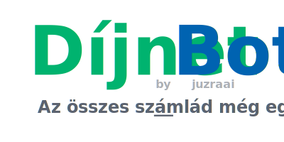

# <div align="center"></div>

A **Díjnet Bot** lementi az **összes [Díjnet](https://www.dijnet.hu/)-en tárolt számládat,** így azok immáron még egy helyen, _Nálad is_ meglesznek.


## Funkciók

- **Mindent visz:** az összes számla összes letölthető fájlját lementi (számla PDF, számla XML, terhelési összesítő, ...).
- **Nem gatyázik:** ha valamit már letöltött, legközelebb átugorja, vagyis mindig csak az új számláidat fogja lementeni.
- **Ért a szóból:** többféle módon beállítható, akár környezeti változókkal, akár konfigurációs fájllal, de még parancssori argumentumokkal is.
- **Tettre kész:** a parancssoros interfész és az inkrementális letöltési funkció miatt ideális arra, hogy ütemezett feladatként használd.
- **Rendszerető:** a letöltött fájlokat mappákba rendezi, szolgáltató, szolgáltatás és dátum szerint.
- **Kíméletes:** a lapok és fájlok letöltése között másodperceket vár, hogy a **Díjnet** szerverét ne terhelje túl.

## Használata

A program futtatásának 2 fő módja van: vagy Node.js telepítéssel vagy Docker használatával.

### Futtatás Node.js telepítéssel

Ahhoz, hogy a programot futtatni tudd, telepítened kell a [Node.js](https://nodejs.org/en/) legalább 20-as verzióját.

A **Díjnet Bot** önmagában egyetlen fájl (`dijnet-bot.cjs`), melyet [innen tudsz letölteni](https://github.com/juzraai/dijnet-bot/releases/latest).

Ha duplakattintással szeretnéd futtatni (vagyis nem terminálból/parancssorból), akkor ezt a fájlt, vagy a `*.cjs` fájlokat az oprendszeredben hozzá kell rendelned a Node-hoz. (Windows-on: jobb klikk a fájlon -> Társítás -> Node.js vagy Másik alkalmazás -> "c:\Program Files\nodejs\node.exe")

Egyéb esetben terminálból így tudod elindítani a programot (abból a könyvtárból, ahol a `dijnet-bot.cjs` van):

```bash
node dijnet-bot
```

(Opcionális: ha letöltöd a program forráskódját, és `npm i -g` segítségével telepíted, onnantól kezdve egyszerűen a `dijnet-bot` paranccsal tudod indítani bármilyen könyvtárból.)

A program meg fogja kérdezi a **Díjnet** belépési adataidat, majd alapértelmezett beállításokkal megkezdi a számlák learatását.

A programot szükség esetén a Ctrl+C megnyomásával tudod leállítani.

### Futtatás Docker konténerben

Az alábbi paranccsal tudod elindítani a programot (Linux):

```bash
DOCKER_UID=$(id -u) DOCKER_GID=$(id -g) docker compose up
```

A beállításokat a `.env` fájlból olvassa, de `--env-file` kapcsolóval másik fájl is megadható, vagy a parancs elején is megadhatóak az értékek.

Az DOCKER_UID és DOCKER_GID beállítás azért kell, hogy a Docker az aktuális felhasználóval futtassa a programot és így a letöltött számlákhoz is hozzá tudj férni.

Ha újraépítenéd az image-et, akkor a fenti parancs végén add meg a `--build` kapcsolót.

**Fontos,** hogy a kimeneti mappa létezzen, mielőtt elindítod a programot.

A programot szükség esetén a Ctrl+C megnyomásával vagy ezzel a paranccsal tudod leállítani: `docker compose down`

Alternatívaként Compose nélkül is használhatod (Linux):

```bash
docker build -t dijnet-bot .

docker run --rm -it \
	--user $(id -u):$(id -g) \
	-v ./szamlak:/szamlak \
	--env-file .env \
	--name=dijnet-bot dijnet-bot
```

## Beállítás

A program némely paramétere állítható (pl. kimeneti mappa, kérések közti várakozás). Ha az alapértelmezett beállítások nem felelnek meg, 3 módon tudod a programot konfigurálni:

- konfigfájllal
- környezeti változókkal
- parancssori argumentumokkal

A konfigfájlt `.env` néven kell elmenteni abba a mappába, ahonnan a **Díjnet Bot**-ot futtatod. A beállítási lehetőségekről és a fájl formátumáról a [.env.example fájl](https://github.com/juzraai/dijnet-bot/blob/master/.env.example) ad útbaigazítást.

A `.env.example` fájlban leírt kulcs-érték párokat beállíthatod környezeti változókként is. Az így megadott értékek magasabb prioritást fognak élvezni, mint amit a `.env` fájl tartalmaz.

A parancssori argumentumok leírása és alapértelmezett értékeik a `-h` kapcsolóval tekinthetők meg:

```bash
node dijnet-bot -h
```

Ezek a paraméterek felülbírálják a környezeti változókat is.

Ha a program egyik fenti módon sem kap **Díjnet** felhasználónevet vagy jelszót, akkor indításkor meg fogja ezeket kérdezni.

## Működése

1. Bejelentkezik **Díjnet**-en (elküldi a login űrlapot)
1. Rámegy a "Számlák keresése" oldalra
1. Elküldi az űrlapot üresen, hogy megkapja az összes számlát
1. Kiolvassa a számlák adatait, majd végigmegy a számlákon:
    1. Ha ennek a számlának a fájljait még nem töltötte le, akkor:
        1. Megnyitja a számla adatlapját
        1. Rámegy a "Letöltés" fülre
        1. Letölti az összes fájlt, ami be van linkelve
        1. Megjelöli ezt a számlát, hogy a program későbbi futtatásánál ne töltse le újra
        1. Visszamegy a számla listához

Az eredmény, vagyis **a letöltött fájlok a kimeneti mappába kerülnek** (alapértelmezésként `./szamlak`), szolgáltató, szolgáltatás és dátum bontásban. A könyvtárszerkezet az alábbiak szerint alakul:

```
szamlak/
	szolgáltató neve - szolgáltatási azonosító/
		dátum/
			számla fájljai
```

A szolgáltató neve és a szolgáltatási azonosító normalizálva lesz, a felismerhető ékezetes karakterek át lesznek alakítva ékezet nélkülivé, minden egyéb nem alfanumerikus karakter pedig el lesz távolítva. A számlák egyes fájljai úgy lesznek elnevezve, ahogy a **Díjnet** szerver generálja.

A program minden alkalommal, **mielőtt kérést küld a Díjnet felé, vár néhány másodpercet.** Az érték állítható, javallott legalább 3-5 másodpercet megadni. Erre azért van szükség, hogy a **Díjnet** szerverét minél kevésbé terheljük.

A program a kimeneti mappán belül a `kesz.txt` fájlba beírja azon számlák azonosítóját (számlaszám/bizonylatszám), amelyeknek minden fájlját sikerült lementeni. Így a következő futtatásakor ezeket a számlákat át tudja ugrani, vagyis **csak az újabb (vagy korábban nem lementett) számlákkal fog foglalkozni.**

## Motiváció

A **Díjnet** az ingyenes szolgáltatása keretében **csak bizonyos ideig őrzi meg** a számlákat. Ha később is el akarjuk érni a fájlokat, akkor

- vagy [fizetünk a **SzámlaPlusz** funkcióért](https://www.dijnet.hu/docs/hu/szamlaplusz_tajekoztato.pdf) (évi ~1 500 Ft),
- vagy rendszeresen **lementjük kézzel**, ami fáradtságos munka lehet.

A **Díjnet Bot** az utóbbi megoldás **automatizálására szolgál**, vagyis gyakorlatilag helyettünk kattintgat végig a számlákon és a **Díjnet** által biztosított letöltési linkeken.

A fenti két út természetesen nem zárja ki egymást, a **SzámlaPlusz funkcióra érdemes előfizetni** még a **Díjnet Bot** használata mellett is, mert minél több helyen vannak meg a fontos fájljaink, annál jobb.

Az automatizálási feladatra már mások is készítettek szkripteket (pl. [wolandmaster/dijnet-dump](https://github.com/wolandmaster/dijnet-dump)). Én ezeket nem próbáltam ki, mert kihívást éreztem abban, hogy magam is összerakjak egy ilyen programot nulláról, elsősorban saját célra, saját igények szerint.

## Licensz

[MIT](LICENSE)

## Közreműködés

Ha kérdésed, ötleted, igényed (feature request) van, bátran nyiss egy ticketet az [_Issues_ fülön](https://github.com/juzraai/dijnet-bot/issues)! :)

Ha hibát találtál, kérlek szintén jelezd ugyanitt, megadva minél több részletet a hibához (hibaüzenet, `error.log` fájl tartalma, vagy elvárt és tapasztalt működés különbsége).

Ha netán meg is bütyköltél valamit, lécci küldj egy pull request-et.
